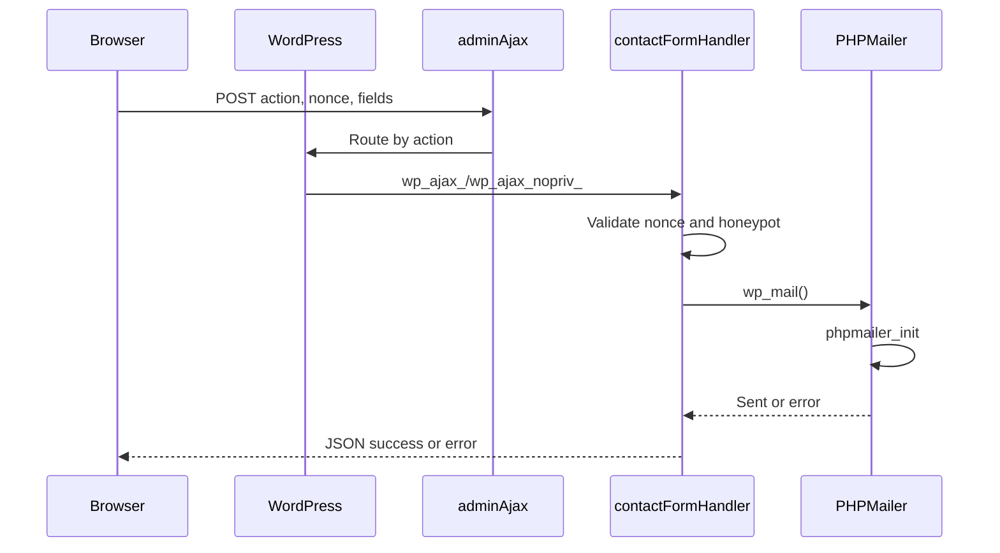

# Opis wysylki formularza w WordPress (AJAX + nonce + honeypot)

## 1) Po stronie przegladarki (frontend)

### Ukryte pola w formularzu
Formularz zawiera ukryte pola:
- `action` – nazwa akcji AJAX w WordPress, np. `contact_form_submit`.
  Sluzy do dopasowania requestu do hookow `wp_ajax_{action}` i `wp_ajax_nopriv_{action}`.
- `nonce` – token bezpieczenstwa (WP nonce).
  Sluzy do ochrony przed CSRF. Weryfikowany po stronie serwera.
- `website` – pole honeypot (ukryte).
  Sluzy do blokowania botow. Jesli jest wypelnione, serwer odrzuca request.

### Atrybut `action` formularza
`action` wskazuje URL endpointu AJAX:
```
/wp-admin/admin-ajax.php
```
Gdy formularz jest wysylany przez JS (AJAX), `action` jest fallbackiem.
Gdy JS jest wylaczony, formularz moze sie wyslac klasycznie.

### Do czego sluzy honeypot i nonce
- **Honeypot**: ukryte pole, ktorego czlowiek nie wypelni. Boty czesto wypelniaja wszystkie pola — wtedy serwer odrzuca request.
- **Nonce**: token generowany w WordPress, sprawdzany po stronie serwera, chroni przed nieautoryzowanymi zadaniami.

## 2) Po stronie serwera (WordPress)

## Diagram przeplywu



### Kolejnosc i logika wywolan
1. Request trafia do `wp-admin/admin-ajax.php`.
2. WordPress odczytuje `$_POST['action']`.
3. Uruchamia odpowiedni hook:
   - `wp_ajax_{action}` – gdy uzytkownik jest zalogowany.
   - `wp_ajax_nopriv_{action}` – gdy niezalogowany.
4. Wywolywany jest zarejestrowany callback (nasza funkcja).

### Akcje i filtry w aktualnym kodzie

#### `add_action('wp_ajax_contact_form_submit', 'handle_contact_form_submit')`
- Obsluga AJAX dla zalogowanych.

#### `add_action('wp_ajax_nopriv_contact_form_submit', 'handle_contact_form_submit')`
- Obsluga AJAX dla niezalogowanych.

#### `add_action('phpmailer_init', function ($phpmailer) { ... })`
- Konfiguracja SMTP (Gmail):
  - `Host`, `Port`, `SMTPSecure`, `Username`, `Password`.
- Wywolywane zawsze przed `wp_mail()` (WordPress tworzy PHPMailer i uruchamia hook).

#### `add_filter('wp_mail_from', ...)`
- Wymusza adres `From` dla wszystkich maili (Gmail wymaga poprawnego `From`).

#### `add_filter('wp_mail_from_name', ...)`
- Ustawia nazwe nadawcy.

### Funkcje w kodzie i ich rola

#### `handle_contact_form_submit()`
1. Pobiera dane z `$_POST`.
2. Sprawdza nonce:
   - `wp_verify_nonce($nonce, 'contact_form_submit')`.
3. Sprawdza honeypot (`website`) – jesli wypelnione, odrzuca.
4. Waliduje `email` i `message`.
5. Buduje temat i tresc wiadomosci.
6. Ustawia `Reply-To` na adres uzytkownika.
7. Wysyla maila przez `wp_mail()`.
8. Zwraca JSON success/error.

#### `wp_mail()`
- Funkcja WordPress do wysylki maili.
- Tworzy PHPMailer.
- Wywoluje `do_action('phpmailer_init', $phpmailer)`.
- Wysyla maila z ustawionym SMTP.
